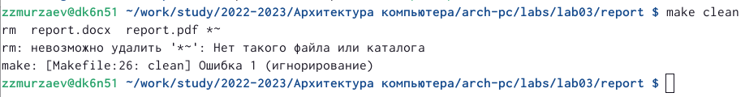

---
## Front matter
title: "Отчёт по лабораторной работе №3"
subtitle: "Дисциплина: Архитектура компьютера"
author: "Мурзаев Замир Зейнадинович НБИбд-02-22"

## Generic otions
lang: ru-RU
toc-title: "Содержание"

## Bibliography
bibliography: bib/cite.bib
csl: pandoc/csl/gost-r-7-0-5-2008-numeric.csl

## Pdf output format
toc: true # Table of contents
toc-depth: 2
lof: true # List of figures
lot: true # List of tables
fontsize: 12pt
linestretch: 1.5
papersize: a4
documentclass: scrreprt
## I18n polyglossia
polyglossia-lang:
  name: russian
  options:
	- spelling=modern
	- babelshorthands=true
polyglossia-otherlangs:
  name: english
## I18n babel
babel-lang: russian
babel-otherlangs: english
## Fonts
mainfont: PT Serif
romanfont: PT Serif
sansfont: PT Sans
monofont: PT Mono
mainfontoptions: Ligatures=TeX
romanfontoptions: Ligatures=TeX
sansfontoptions: Ligatures=TeX,Scale=MatchLowercase
monofontoptions: Scale=MatchLowercase,Scale=0.9
## Biblatex
biblatex: true
biblio-style: "gost-numeric"
biblatexoptions:
  - parentracker=true
  - backend=biber
  - hyperref=auto
  - language=auto
  - autolang=other*
  - citestyle=gost-numeric
## Pandoc-crossref LaTeX customization
figureTitle: "Рис."
tableTitle: "Таблица"
listingTitle: "Листинг"
lofTitle: "Список иллюстраций"
lotTitle: "Список таблиц"
lolTitle: "Листинги"
## Misc options
indent: true
header-includes:
  - \usepackage{indentfirst}
  - \usepackage{float} # keep figures where there are in the text
  - \floatplacement{figure}{H} # keep figures where there are in the text
---

# Цель работы

Целью работы является освоение процедуры оформления отчетов с помощью легковесного языка разметки Markdown

# Задания
1. В соответствующем каталоге сделайте отчёт по лабораторной работе No 3
в формате Markdown. В качестве отчёта необходимо предоставить отчёты
в 3 форматах: pdf, docx и md.
2. Загрузите файлы на github.

# Теоретическое введение

Markdown — облегчённый язык разметки, созданный с целью обозначения форматирования в простом тексте, с максимальным сохранением его читаемости человеком, и пригодный для машинного преобразования в языки для продвинутых публикаций (HTML, Rich Text и других). 

В Markdown вставить изображение в документ можно с помощью непосред-
ственного указания адреса изображения. Синтаксис данной команды выглядит
следующим образом:
• в квадратных скобках указывается подпись к изображению;
• в круглых скобках указывается URL-адрес или относительный путь изоб-
ражения, а также (необязательно) всплывающую подсказку, заключённую
в двойные или одиночные кавычки.
• в фигурных скобках указывается идентификатор изображения (#fig:fig1)
для ссылки на него по тексту и размер изображения относительно ширины
страницы (width=90%)

После внесения изменений в текстовый редактор, сохраняем изменения и переносим их в файлы pdf и docx c помощью команды make. Затем можно переместить все эти изменения и в репозиторий на гитхаб с помощью последовательностей команд: 1)git add . 2)git commit -am 'feat(main): add files "адрес файла" 3)git push

# Выполнение лабораторной работы
Задание 1

1)Переходим в каталог курса, сформированный при выполнении лабораторной работы №2 и обновляем локальный репозиторий, скачав изменения из удаленного репозитория с помощью команды git pull, как на рисунке [-@fig:002]

{ #fig:002 width=90% }

2)Проводим компиляцию шаблона [-@fig:003]

{ #fig:003 width=90% }

3)Проверяем корректность выполнения команд как на рисунке [-@fig:004]

{ #fig:004 width=90% }

4)Удаляем получившиеся файлы [-@fig:005]

{ #fig:005 width=90% }

5)Проверяем корректность удаления файлов, что продемонстрировано на изображении [-@fig:006]

{ #fig:006 width=90% }

6)Открываем файл report.md (я использовал редактор gedit). Смотреть рис [-@fig:007]

{ #fig:007 width=90% }

Задание 2
Загружаем файлы на гитхаб как на рисунке [-@fig:008]

{ #fig:008 width=90% }

# Выводы

Мы научились оформлять отчеты с помощью легковесного языка markdown.

# Список литературы{.unnumbered}

::: {#refs}
:::
