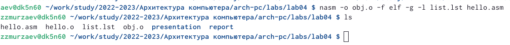

---
## Front matter
title: "Отчёт по лабораторной работе №4"
subtitle: "Дисциплина: Архитектура компьютера"
author: "Мурзаев Замир Зейнадинович НБИбд-02-22"

## Generic otions
lang: ru-RU
toc-title: "Содержание"

## Bibliography
bibliography: bib/cite.bib
csl: pandoc/csl/gost-r-7-0-5-2008-numeric.csl

## Pdf output format
toc: true # Table of contents
toc-depth: 2
lof: true # List of figures
lot: true # List of tables
fontsize: 12pt
linestretch: 1.5
papersize: a4
documentclass: scrreprt
## I18n polyglossia
polyglossia-lang:
  name: russian
  options:
	- spelling=modern
	- babelshorthands=true
polyglossia-otherlangs:
  name: english
## I18n babel
babel-lang: russian
babel-otherlangs: english
## Fonts
mainfont: PT Serif
romanfont: PT Serif
sansfont: PT Sans
monofont: PT Mono
mainfontoptions: Ligatures=TeX
romanfontoptions: Ligatures=TeX
sansfontoptions: Ligatures=TeX,Scale=MatchLowercase
monofontoptions: Scale=MatchLowercase,Scale=0.9
## Biblatex
biblatex: true
biblio-style: "gost-numeric"
biblatexoptions:
  - parentracker=true
  - backend=biber
  - hyperref=auto
  - language=auto
  - autolang=other*
  - citestyle=gost-numeric
## Pandoc-crossref LaTeX customization
figureTitle: "Рис."
tableTitle: "Таблица"
listingTitle: "Листинг"
lofTitle: "Список иллюстраций"
lotTitle: "Список таблиц"
lolTitle: "Листинги"
## Misc options
indent: true
header-includes:
  - \usepackage{indentfirst}
  - \usepackage{float} # keep figures where there are in the text
  - \floatplacement{figure}{H} # keep figures where there are in the text
---

# Цель работы

Целью работы является освоение процедуры компиляции и сборки программ, написанных на ассемблере NASM.

# Задание

1. В каталоге ~/work/arch-pc/lab05 с помощью команды cp создайте копию
файла hello.asm с именем lab5.asm
2. С помощью любого текстового редактора внесите изменения в текст про-
граммы в файле lab5.asm так, чтобы вместо Hello world! на экран выво-
дилась строка с вашими фамилией и именем.
3. Оттранслируйте полученный текст программы lab5.asm в объектный
файл. Выполните компоновку объектного файла и запустите получивший-
ся исполняемый файл.
4. Скопируйте файлы hello.asm и lab5.asm в Ваш локальный репозиторий
в каталог ~/work/study/2022-2023/"Архитектура компьютера"/arch-
pc/labs/lab05/. Загрузите файлы на Github.

# Теоретическое введение

Процесс создания ассемблерной программы можно изобразить в виде следующей схемы [-@fig:020]

{ #fig:020 width=90% }

В процессе создания ассемблерной программы можно выделить четыре шага:

• Набор текста программы в текстовом редакторе и сохранение её в от-
дельном файле. Каждый файл имеет свой тип (или расширение), который
определяет назначение файла. Файлы с исходным текстом программ на
языке ассемблера имеют тип asm.

• Трансляция — преобразование с помощью транслятора, например nasm,
текста программы в машинный код, называемый объектным. На данном
этапе также может быть получен листинг программы, содержащий кроме
текста программы различную дополнительную информацию, созданную
транслятором. Тип объектного файла — o, файла листинга — lst.

• Компоновка или линковка — этап обработки объектного кода компонов-
щиком (ld), который принимает на вход объектные файлы и собирает по
ним исполняемый файл. Исполняемый файл обычно не имеет расшире-
ния. Кроме того, можно получить файл карты загрузки программы в ОЗУ,
имеющий расширение map.

• Запуск программы. Конечной целью является работоспособный испол-
няемый файл. Ошибки на предыдущих этапах могут привести к некор-
ректной работе программы, поэтому может присутствовать этап отладки
программы при помощи специальной программы — отладчика. При на-
хождении ошибки необходимо провести коррекцию программы, начиная
с первого шага.

# Выполнение лабораторной работы

Создаем новый каталог, как на рисунке [-@fig:001], но в нашем случае каталог уже существует, поэтому терминал и выдаёт ошибку.

{ #fig:001 width=90% }

Переходим в данный каталог, создаём в нём текстовый файл и открываем его через текстовый редактор gedit, как на рис [-@fig:002].

{ #fig:002 width=90% }

Вводим в файл следующий текст: [-@fig:003]

{ #fig:003 width=90% }

Скомпилируем текст написанной программы с помощью команды как на рис [-@fig:004]

{ #fig:004 width=90% }

Проверка успешности совершения команды на рис [-@fig:005]

{ #fig:005 width=90% }

Скомпилируем тот же самый файл, только теперь зададим сами имя для объектного файла murzaev.o, как на рис [-@fig:006]

{ #fig:006 width=90% }

Компановка программы на рис [-@fig:007] и последующая порверка с помощью ls

{ #fig:007 width=90% }

Сделаем то же самое с другими файлами как на рис [-@fig:008]. Исполняемый файл будет иметь имя main, а объектный - obj.o

{ #fig:008 width=90% }

Формат командно строки LD можно увидеть, если ввести ld --help, как на рисунке [-@fig:009] 

{ #fig:009 width=90% }

Чтобы запустить исполняемый файл, нужно набрать в командной строке ./и имя файла, смотреть на рис [-@fig:010]

{ #fig:010 width=90% }

# Задания самостоятельной работы

1)C помощью команды cp создайте копию файла hello.asm с именем lab4.asm, смотреть на рис [-@fig:011]

{ #fig:011 width=90% }

2)С помощью текстового редактора gedit [-@fig:012] изменяю текст в файле так, чтобы вместо Hello world! выводились мои имя и фамилия [-@fig:013]

{ #fig:012 width=90% }

{ #fig:013 width=90% }

3)Компилируем объектный файл, выполняем компоновку объектного файла и запускаем получившийся исполняемый файл, [-@fig:014]

{ #fig:014 width=90% }

Нам осталось только скопировать получившиеся файлы в локальный репозиторий и запустить на github. Весь процесс отображен на рис [-@fig:015]

{ #fig:015 width=90% }

# Выводы

Освоил процедуры компиляции и сборки программ, написанных на ассемблере NASM.

# Список литературы{.unnumbered}

::: {#refs}
:::
