---
## Front matter
title: "Шаблон отчёта по лабораторной работе"
subtitle: "Простейший вариант"
author: "Дмитрий Сергеевич Кулябов"

## Generic otions
lang: ru-RU
toc-title: "Содержание"

## Bibliography
bibliography: bib/cite.bib
csl: pandoc/csl/gost-r-7-0-5-2008-numeric.csl

## Pdf output format
toc: true # Table of contents
toc-depth: 2
lof: true # List of figures
lot: true # List of tables
fontsize: 12pt
linestretch: 1.5
papersize: a4
documentclass: scrreprt
## I18n polyglossia
polyglossia-lang:
  name: russian
  options:
	- spelling=modern
	- babelshorthands=true
polyglossia-otherlangs:
  name: english
## I18n babel
babel-lang: russian
babel-otherlangs: english
## Fonts
mainfont: PT Serif
romanfont: PT Serif
sansfont: PT Sans
monofont: PT Mono
mainfontoptions: Ligatures=TeX
romanfontoptions: Ligatures=TeX
sansfontoptions: Ligatures=TeX,Scale=MatchLowercase
monofontoptions: Scale=MatchLowercase,Scale=0.9
## Biblatex
biblatex: true
biblio-style: "gost-numeric"
biblatexoptions:
  - parentracker=true
  - backend=biber
  - hyperref=auto
  - language=auto
  - autolang=other*
  - citestyle=gost-numeric
## Pandoc-crossref LaTeX customization
figureTitle: "Рис."
tableTitle: "Таблица"
listingTitle: "Листинг"
lofTitle: "Список иллюстраций"
lotTitle: "Список таблиц"
lolTitle: "Листинги"
## Misc options
indent: true
header-includes:
  - \usepackage{indentfirst}
  - \usepackage{float} # keep figures where there are in the text
  - \floatplacement{figure}{H} # keep figures where there are in the text
---

# Цель работы

Цель работы - приобретение практических навыков работы в Midnight Commander. Освоение инструкций языка ассамблера mov и int.

# Задание

1. Создайте копию файла lab6-1.asm. Внесите изменения в программу (без
использования внешнего файла in_out.asm), так чтобы она работала по
следующему алгоритму:
• вывести приглашение типа “Введите строку:”;
• ввести строку с клавиатуры;
• вывести введённую строку на экран.
2. Получите исполняемый файл и проверьте его работу. На приглашение
ввести строку введите свою фамилию.
3. Создайте копию файла lab6-2.asm. Исправьте текст программы с использование подпрограмм из внешнего файла in_out.asm, так чтобы она работала по следующему алгоритму:
• вывести приглашение типа “Введите строку:”;
• ввести строку с клавиатуры;
• вывести введённую строку на экран.
Не забудьте, подключаемый файл in_out.asm должен лежать в том же
каталоге, что и файл с программой, в которой он используется.
4. Создайте исполняемый файл и проверьте его работу.

# Теоретическое введение

Midnight Commander (или просто mc) — это программа, которая позволяет
просматривать структуру каталогов и выполнять основные операции по управлению файловой системой, т.е. mc является файловым менеджером. Midnight
Commander позволяет сделать работу с файлами более удобной и наглядной.
Для активации оболочки Midnight Commander достаточно ввести в командной
строке mc и нажать клавишу Enter.

Функциональные
клавиши

F1 вызов контекстно-зависимой подсказки

F2 вызов меню, созданного пользователем

F3 просмотр файла, на который указывает подсветка в активной
панели

F4 вызов встроенного редактора для файла, на который указывает
подсветка в активной панели

F5 копирование файла или группы отмеченных файлов из каталога,
отображаемого в активной панели, в каталог, отображаемый на
второй панели

F6 перенос файла или группы отмеченных файлов из каталога,
отображаемого в активной панели, в каталог, отображаемый на
второй панели

F7 создание подкаталога в каталоге, отображаемом в активной
панели

F8 удаление файла (подкаталога) или группы отмеченных файлов

F9 вызов основного меню программы

F10 выход из программы

Следующие комбинации клавиш облегчают работу с Midnight Commander:

• Tab используется для переключениями между панелями;

• ↑ и ↓ используется для навигации, Enter для входа в каталог или открытия файла (если в файле расширений mc.ext заданы правила связи
определённых расширений файлов с инструментами их запуска или обработки);

• Ctrl + u (или через меню Команда > Переставить панели ) меняет местами
содержимое правой и левой панелей;

• Ctrl + o (или через меню Команда > Отключить панели ) скрывает или воз-
вращает панели Midnight Commander, за которыми доступен для работы
командный интерпретатор оболочки и выводимая туда информация.

• Ctrl + x + d (или через меню Команда > Сравнить каталоги ) позволяет сравнить содержимое каталогов, отображаемых на левой и правой панелях.

# Выполнение лабораторной работы

Открываем Midnight commander через терминал, как на рис [-@fig:001]

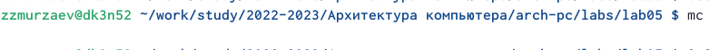{ #fig:001 width=70% }

С помощью клавиатуры переходим в каталог work/arch-pc рис [-@fig:002] и создаем папку lab05 рис [-@fig:003]

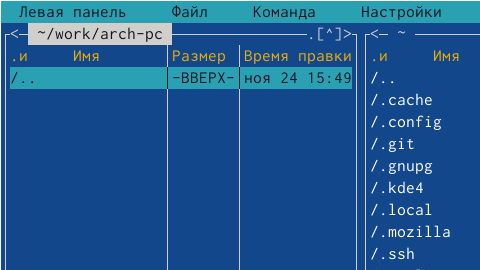{ #fig:002 width=70% }

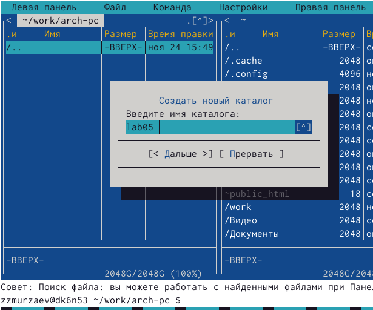{ #fig:003 width=70% }

Пользуясь строкой ввода, создаем файл lab5-1.asm рис [-@fig:004]

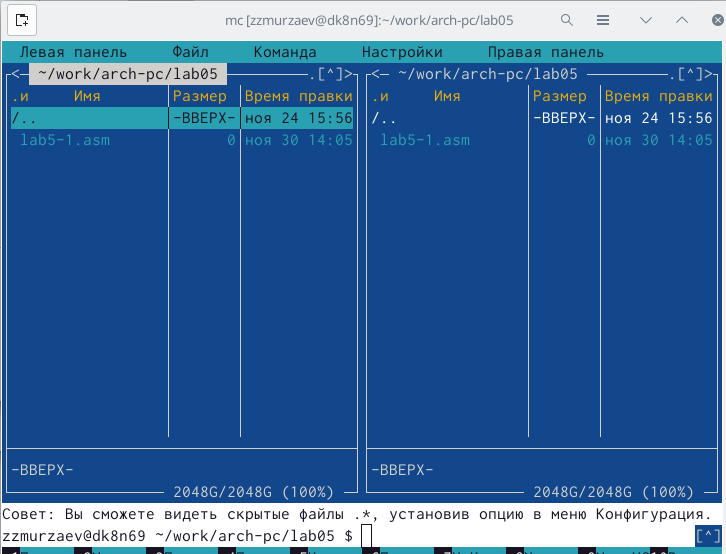{ #fig:004 width=70% }

С помощью клавиши F4 открываем файл для редактирования во встроенном редакторе (в моём случае это mcedit), вводим текст программы (рис[-@fig:005]) и с помощью клавиши F2 сохраняем изменения (рис[-@fig:006]), с помощью клавиши F10 выходим из редактора и в конце с помощью клавиши F3 проверяем содержимое файла (рис[-@fig:006])

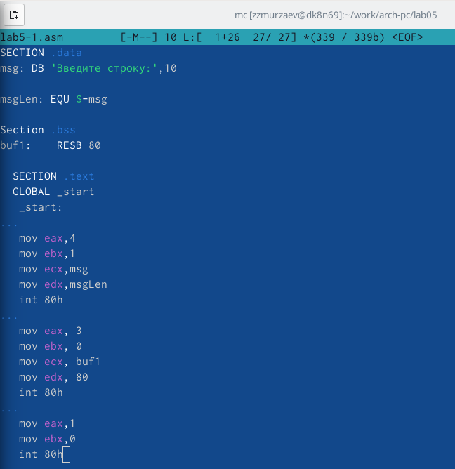{ #fig:005 width=70% }

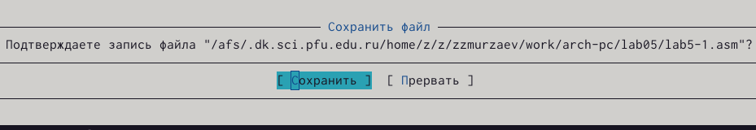{ #fig:006 width=70% }

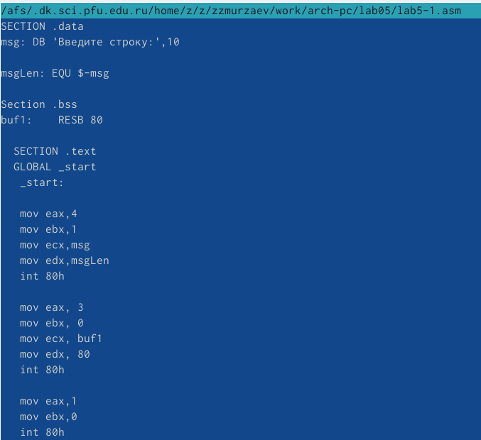{ #fig:007 width=70% }

Делаем из текста нашей программы объектный файл, а тот компилируем в исполняемый файл рис [-@fig:008]

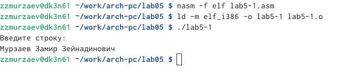{ #fig:008 width=70% }

Скачиваем файл in_out.asm

C помощью midnight commander копируем скачанный файл в каталог, в котором мы работаем, рис [-@fig:009]

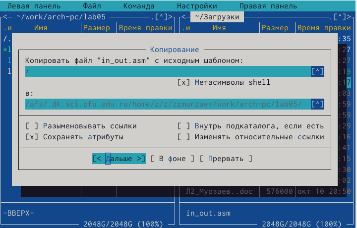{ #fig:009 width=70% }

Делаем тоже самое с asm файлом, только делаем копию в том же каталоге, но с другим названием, рис [-@fig:010]

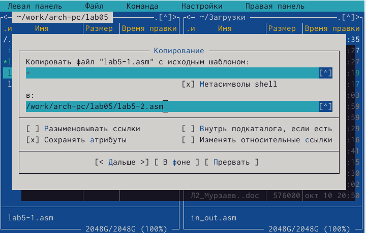{ #fig:010 width=70% }

Исправляем текст программы в файле lab5-2.asm с использованием подпрограмм из файла in_out.asm рис [-@fig:011]

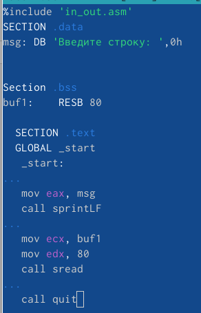{ #fig:011 width=70% }

Создаем исполняемый файл и проверяем его работу, рис [-@fig:012]

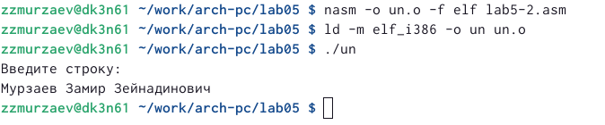{ #fig:012 width=70% }

Теперь меняем подпрограмму sprintLF на sprint и приверяем его работу, рис [-@fig:013]

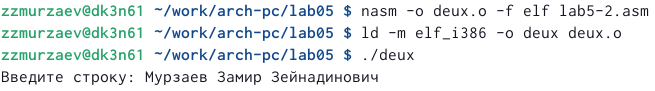{ #fig:013 width=70% }

Разница заключается в том, что в превом случае введенный текст (ФИО) выводятся на новую строку, а во втором случае - все на одной строке. Так происходит потому что подпрограмма sprint просто выводит сообщение на экран, а sprintLF работает аналогично, только прибавляет к сообщению сивол перевода строки. 

# Задание для самостоятельной работы

Создаем копию файла lab5-1.asm, рис [-@fig:014]

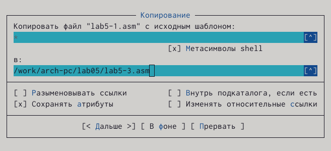{ #fig:014 width=70% }

Вносим изменения в программу, чтобы она работала по заданному алгоритму и без использования внешнего файла, рис [-@fig:015]

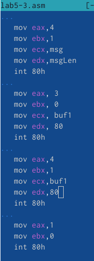{ #fig:015 width=70% }

Создаем исполняемый файл и проверяем его работу, рис [-@fig:016]

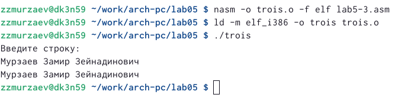{ #fig:016 width=70% }

Создаем копию файла lab5-4.asm, рис [-@fig:017]

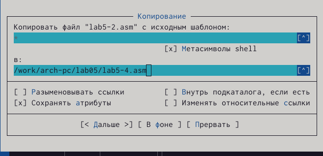{ #fig:017 width=70% }

Вносим изменения в программу, чтобы она работала по заданному алгоритму с использованием внешнего файла, рис [-@fig:018]

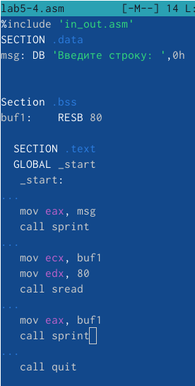{ #fig:018 width=70% }

Создаем исполняемый файл и проверяем его работу, рис [-@fig:019]

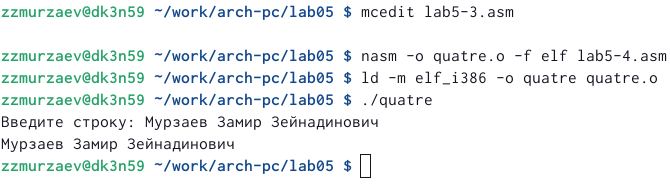{ #fig:019 width=70% }
# Выводы

Приобрел практические навыки работы в Midnight Commander. Освоение инструкций языка ассамблера mov и int.

# Список литературы{.unnumbered}

::: {#refs}
:::
